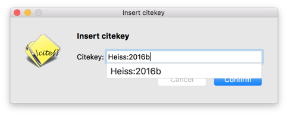

# km-citekeys

Displays an autocomplete dialog box populated with citekeys from a [BibTeX file](http://www.bibtex.org/) using [Keyboard Maestro](https://www.keyboardmaestro.com/main/).

## Instructions

1. Set up [pandoc-citekeys](https://github.com/andrewheiss/pandoc-citekeys) to periodically write a list of citekeys to a text file
2. Open `Insert citekey.kmmacros` in Keyboard Maestro and make these changes:
    1. Set the `htmlBaseFolder` variable to this directory
    2. Set the `citekeyList` variable to the text file of citekeys
    3. Set the path to the custom HTML prompt in `citekey_dialog.html`
    4. Modify the hotkey to whatever you want (default: `^⌥⌘K`)

## Credits

This is heavily adapted and borrowed from @inik's original [Fancy Keyboard Maestro Custom HTML Prompts](http://blog.nik.me/post/142530887153/fancy-keyboard-maestro-custom-html-prompts), following multiple discussions ([1](https://forum.keyboardmaestro.com/t/fancy-mac-like-html-prompts-library/3361) [2](https://forum.keyboardmaestro.com/t/update-macros-programmatically/4262)) at the Keyboard Maestro forums.
